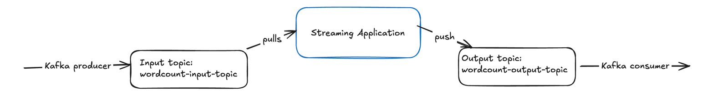

# Start Kafka (KRaft mode, no Zookeeper step)


```shell
cd Desktop/kafka_2.13-4.1.1


export KAFKA_CLUSTER_ID="$(bin/kafka-storage.sh random-uuid)"

bin/kafka-storage.sh format --standalone -t $KAFKA_CLUSTER_ID -c config/server.properties
```

# 1/ Start Kafka Broker (Keep this terminal running.)
bin/kafka-server-start.sh config/server.properties

# 2/ Create Topcis in another terminal 

```shell
bin/kafka-topics.sh --create \
  --bootstrap-server localhost:9092 \
  --replication-factor 1 \
  --partitions 2 \
  --topic wordcount-input-topic
  
 bin/kafka-topics.sh --create \
  --bootstrap-server localhost:9092 \
  --replication-factor 1 \
  --partitions 2 \
  --topic wordcount-output-topic
```

# 3/ To List the topics
```shell
bin/kafka-topics.sh --list --bootstrap-server localhost:9092
```

# 3/ launch kafka consumer to consume from the topics 

```shell
bin/kafka-console-consumer.sh --bootstrap-server localhost:9092 \
  --topic wordcount-output-topic \
  --from-beginning \
  --property print.key=true \
  --property print.value=true \
  --property key.deserializer=org.apache.kafka.common.serialization.StringDeserializer \
  --property value.deserializer=org.apache.kafka.common.serialization.LongDeserializer
```

# 4/ Launch the stream App 
Run `WordCountApp.java` Application in ID.
You must see list of logs outlining Kafka Values. If not, check log4j App.  

# 5. Run Kafka Producer to the input topic in another terminal

```shell
bin/kafka-console-producer.sh --bootstrap-server localhost:9092 --topic wordcount-input-topic
```

# Sidenote: 
1. Kafka streams takes sometime to produce the result- 